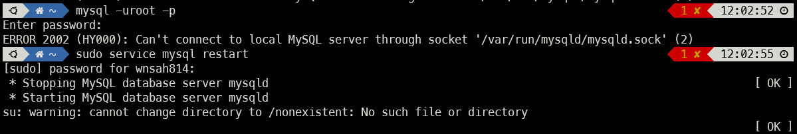

# PROJ#1 수강신청

수업일: 2022년 11월 8일
유형: 실습

# 개발환경

-   WSL2
-   Ubuntu 20.04.4 LTS
-   **node v18.12.0**
    -   nodejs 설치
        nvm(node version manager)를 통해 다운받을 것이다. (https://github.com/nvm-sh/nvm)
        ```bash
        curl -o- https://raw.githubusercontent.com/nvm-sh/nvm/v0.39.2/install.sh | bash
        ```
        기존에 사용중이던 node가 설치되어 있어서 지워주고 최신 LTS 버전을 다운받아줬다.
        가장 최신의 LTS 버전을 설치해준다
        ```bash
        nvm install --lts
        ```
        잘 설치되었는지 확인해주었다
        ```bash
        nvm ls
        ```
-   express v4.18.2
-   npm(npx) v8.19.2
-   mysql v8.0.30 (-0ubuntu0.20.04.2 for Linux on x86_64)
    -   sql 접속
        ```bash
        mysql -uroot -p
        ```
    -   sql 파일 실행하는 법
        ```sql
        use proj1; #proj1 : db_name
        source [file.sql]
        ```
    -   sql 재시작
        가끔 sql이 실행되지 않을 때가 있다. 이럴땐 재시작 해주면 된다.
        
        ```bash
        sudo service mysql restart
        ```

# **빌드 및 실행 과정**

```json
// server package.json 일부
"dependencies": {
        "concurrently": "^7.5.0",
        "cors": "^2.8.5",
        "express": "^4.18.2",
        "mysql": "^2.18.1",
        "nodemon": "^2.0.20"
}
```

```json
// client package.json 일부
"dependencies": {
        "@testing-library/jest-dom": "^5.16.5",
        "@testing-library/react": "^13.4.0",
        "@testing-library/user-event": "^13.5.0",
        "axios": "^1.1.3",
        "cors": "^2.8.5",
        "http-proxy-middleware": "^2.0.6",
        "react": "^18.2.0",
        "react-dom": "^18.2.0",
        "react-router-dom": "^6.4.2",
        "react-scripts": "5.0.1",
        "web-vitals": "^2.1.4"
}
```

노드 모듈들을 다운받는다. (package.json 의 dependency)

```json
npm install
```

상위 폴더에서 아래 명령어를 실행한다.

```sql
npm run start
```

# 스키마 디자인


-   student
    -   status: 학생의 상태를 나타낸다. [0, 1, 2] ⇒ [”재학”, “휴학”, “졸업”] 에 대응된다.
-   lecturer
-   staff
    -   level: 관리자 등급을 나타낸다. 현재 사용중인 값은 0과 1로, 0은 교수가 아닌 관리자, 1은 교수를 의미한다.
-   applied
    -   수강신청 정보와 해당 학기의 성적을 담고 있다. 한 학기(이 시스템에서는 1년)이 끝나면 takes로 정보가 이동된다.
-   wanted
    -   학생들의 수강신청 희망 정보를 가지고 있다.
    -   success는 수강 성공여부를 담고 있는 것으로 설계하였지만 사용하지는 않았다.
    -   수강신청 기간이 끝나면 이 테이블의 데이터들은 날려버린다.
-   takes
    -   학생들의 지난 모든 성적을 가지고 있다 (현재 학기 제외)
    -   year는 수강년도를 말한다.
    -   grade는 [4.5, 4.0, 3.5, 3.0, 2.5, 2.0, 1.5, 1.0, 0.5, 0.0] ⇒ [”A+”, “A0”, “B+”, “B0”, “C+”, “C0”, “D+”, “D0”, “P”, “F”]로 대응된다.
-   major
-   class
-   course
-   time
    -   수업(class)에 대응하는 시간 정보를 가지고 있다.
    -   평일 18시 이후, 토요일은 E-러닝으로 구분된다.
    -   일요일은 수업이 없다.
    -   begin 이 “no” 인 것은 미지정 이라는 뜻이다.(없을 수록 좋다)
-   building
-   room
    -   주어진 테이블은 호수 구분이 따로 없는 것 같아서 room_no를 새로 추가하였다
    -   room_no가 몇호인지 알려준다
    -   room_id는 구분용으로 사용된다
-   **SQL DDL (CREATE)**

    ```sql
    CREATE TABLE staff (
    	staff_id INTEGER NOT NULL PRIMARY KEY,
    	password varchar(10) not null,
        name varchar(30) not null,
        sex varchar(6) not null,
        level INTEGER NOT NULL
    );

    CREATE TABLE course(
       course_id VARCHAR(7) NOT NULL PRIMARY KEY,
       name      VARCHAR(17) NOT NULL,
       credit    INTEGER  NOT NULL
    );

    CREATE TABLE building(
       building_id INTEGER  NOT NULL PRIMARY KEY,
       name 	   VARCHAR(8) NOT NULL,
       admin 	   VARCHAR(4) NOT NULL,
       rooms       INTEGER  NOT NULL
    );

    CREATE TABLE major(
       major_id INTEGER  NOT NULL PRIMARY KEY,
       name     VARCHAR(17) NOT NULL
    );

    CREATE TABLE room(
       room_id     INTEGER NOT NULL AUTO_INCREMENT PRIMARY KEY,
       room_no     INTEGER NOT NULL,
       building_id INTEGER NOT NULL,
       occupancy   INTEGER NOT NULL,
       foreign key (building_id)
    	references building(building_id)
        on delete cascade
    );

    CREATE TABLE lecturer(
       lecturer_id INTEGER  NOT NULL PRIMARY KEY,
       name        VARCHAR(30) NOT NULL,
       sex         VARCHAR(6) NOT NULL,
       major_id    INTEGER  NOT NULL,
       foreign key (major_id) references major(major_id)
    );

    CREATE TABLE student(
       student_id  INTEGER  NOT NULL PRIMARY KEY,
       password    VARCHAR(10) NOT NULL,
       name        VARCHAR(30) NOT NULL,
       sex         VARCHAR(6) NOT NULL,
       major_id    INTEGER  NOT NULL,
       lecturer_id INTEGER  NOT NULL,
       year        INTEGER  NOT NULL,
       status      INTEGER NOT NULL,
       foreign key (lecturer_id) references lecturer(lecturer_id),
       foreign key (major_id) references major(major_id)
    );

    CREATE TABLE class(
       class_id    INTEGER  NOT NULL AUTO_INCREMENT,
       class_no    INTEGER  NOT NULL,
       course_id   VARCHAR(7) NOT NULL,
       major_id    INTEGER  NOT NULL,
       year        INTEGER  NOT NULL,
       lecturer_id INTEGER  NOT NULL,
       person_max  INTEGER  NOT NULL,
       opened      INTEGER  NOT NULL,
       room_id     INTEGER  NOT NULL,
       primary key (class_id),
       foreign key (course_id) references course(course_id),
       foreign key (lecturer_id) references lecturer(lecturer_id),
       foreign key (major_id) references major(major_id),
       foreign key (room_id) references room(room_id)
    );

    CREATE TABLE takes(
    	takes_id   INTEGER NOT NULL AUTO_INCREMENT PRIMARY KEY,
    	student_id INTEGER  NOT NULL,
    	course_id  VARCHAR(7) NOT NULL,
        year       INTEGER NOT NULL,
    	grade      DECIMAL(2,1) NOT NULL,
    	foreign key (student_id) references student(student_id)
    );

    CREATE TABLE time(
       time_id  INTEGER  NOT NULL AUTO_INCREMENT PRIMARY KEY,
       class_id INTEGER  NOT NULL,
       period   INTEGER  NOT NULL,
       begin    VARCHAR(24) NOT NULL,
       end      VARCHAR(24) NOT NULL,
       foreign key (class_id)
    			references class(class_id)
    			on delete cascade #class가 삭제되면 time도 삭제된다
    );

    CREATE TABLE applied (
    	applied_id INTEGER NOT NULL AUTO_INCREMENT PRIMARY KEY,
        student_id INTEGER NOT NULL,
        class_id INTEGER NOT NULL,
        grade INTEGER NOT NULL DEFAULT 0,
        FOREIGN KEY (student_id) REFERENCES student(student_id),
        FOREIGN KEY (class_id)
    				REFERENCES class(class_id)
    				on delete cascade #class가 삭제되면 applied도 삭제된다
    );

    CREATE TABLE wanted (
    	wanted_id INTEGER NOT NULL AUTO_INCREMENT PRIMARY KEY,
        student_id INTEGER NOT NULL,
        class_id INTEGER NOT NULL,
        success BOOLEAN NOT NULL DEFAULT 0,
    	FOREIGN KEY (student_id) REFERENCES student(student_id),
        FOREIGN KEY (class_id)
    				REFERENCES class(class_id)
    				on delete cascade #class가 삭제되면 wanted도 삭제된다
    );
    ```

-   SQL FILE
    [proj1.sql](README_ASSETS/proj1.sql)

---

# UI 디자인

-   주로 사용한 색상: #024a84 (파랑 계열), #7db928 (초록 계열)
    -   대학 지정 색상을 사용해보았다.
        [한양대학교](https://www.hanyang.ac.kr/web/www/colors-fonts)

# 구현된 코드 설명

중요했던, 구현하기 힘들었던 코드들만 일부 가져왔다. 나머지는 코드에 주석을 달아 두었다.

### react-nodejs-mysql 연동 (login예시)

기본적인 연동 코드이다.

```jsx
// server > server.js
const express = require("express");
const app = express();

const login = require("./routes/login");

app.use(express.json());
const cors = require("cors");
app.use(cors());

app.use("/api", login);
const port = 4000;
app.listen(port, () => console.log(`Running server on port ${port}`));
```

```jsx
// server > routes > login.js
const express = require("express");
const router = express.Router();
const mysql = require("mysql");
const dbconfig = require("../config/dbconfig.js");
const connection = mysql.createConnection(dbconfig);

router.post("/login", (req, res) => {
    const id = req.body.userId;
    const pwd = req.body.userPassword;
    const isAdmin = req.body.isAdmin;
    let queryString =
        "select * from student where student_id=? and password=?;";
    if (isAdmin) {
        queryString = "select * from staff where staff_id=? and password=?;";
    }

    connection.query(queryString, [id, pwd], (err, rows) => {
        if (err) throw err;
        console.log(rows);
        const userObj = {
            job: "none",
            id: "none",
            name: "none",
            sex: "none",
        };

        if (rows[0] !== undefined) {
            if (isAdmin) {
                if (rows[0].level === 0) {
                    userObj.job = "admin";
                } else {
                    userObj.job = "lecturer";
                }
                userObj.id = rows[0].staff_id;
            } else {
                userObj.job = "student";
                userObj.id = rows[0].student_id;
            }
            userObj.name = rows[0].name;
            userObj.sex = rows[0].sex;
        }
        res.send(userObj);
    });
});
module.exports = router;
```

```jsx
// client > ... > SignIn.js 일부
import axios from "axios";

const handleSignIn = async (e) => {
    /* 생략 */
    const res = await axios.post("http://localhost:4000/api/login", {
        userId: uid,
        userPassword: upw,
        isAdmin: checked,
    });
    const data = res.data;
    if (data.job !== "none") {
        window.sessionStorage.setItem("job", res.data.job);
        window.sessionStorage.setItem("id", idRef.current.value);
        window.sessionStorage.setItem("name", res.data.name);
        window.sessionStorage.setItem("sex", res.data.sex);
        setUserObj(res.data);
        navigate("/");
    } else {
        alert("Wrong ID or password");
        navigate("/signin");
    }
};
```

### timeParse.js

-   시간 값이 표준 UTC 형식으로 되어있기에 이를 파싱하는 함수를 만들어 두었다.

```jsx
// 한 수업의 시작, 끝 정보들을 가지고 문자열을 만든다.
const showTime = (start1, end1, start2, end2) => {
    let time = "";
    if (start1 === null || start1 === undefined || start1 === "") {
        time = "정보없음";
        return time;
    } else if (start1 === "NO") {
        time = "미지정";
        return time;
    } else {
        // 예외처리에서 걸리지 않는 정상 시간 값
        // showOneTime 함수를 통해 시간을 파싱한다.
        time += showOneTime(start1, end1);
    }
    // 여기까지 왔으면 이미 시간 데이터는 정상이다.
    if (start2) {
        time += "\n";
        time += showOneTime(start2, end2);
    }
    return time;
};

// 한 쌍의 시작, 끝 시간데이터를 파싱한다
const showOneTime = (start, end) => {
    const day_start = new Date(start);
    const day_end = new Date(end);
    // UTC기준이라 9시간을 더해줘야한다.
    day_start.setTime(day_start.getTime() + 9 * 60 * 60 * 1000);
    day_end.setTime(day_end.getTime() + 9 * 60 * 60 * 1000);
    const weeks = [
        "일요일",
        "월요일",
        "화요일",
        "수요일",
        "목요일",
        "금요일",
        "토요일",
    ];
    if (day_start.getUTCDay() === 6 || day_start.getUTCHours() >= 18) {
        // 요일 == 6(토) 또는 시작시간 18시 이상 -> E러닝
        return "E-러닝";
    }
    const timeStr = `${weeks[day_start.getUTCDay()]} ${day_start
        .getUTCHours()
        .toString()
        .padStart(2, "0")}:${day_start
        .getUTCMinutes()
        .toString()
        .padStart(2, "0")} - ${day_end
        .getUTCHours()
        .toString()
        .padStart(2, "0")}:${day_end
        .getUTCMinutes()
        .toString()
        .padStart(2, "0")}`;
    return timeStr;
};
export default showTime;
```

### 수강 편람

-   SQL로 수강편람에 필요한 데이터들 가져온다. 이후에 필요하면 조건을 걸어 필터링한다.

```sql
with
cls_crs(class_id, class_no, course_id, major_id, year, lecturer_id, person_max, opened, room_id, class_name, credit) as (
		select class_id, class_no, course_id, major_id, year, lecturer_id, person_max, opened, room_id, name, credit
    from class
    natural join course
), #(0) class와 course를 course_id로 묶음
class_lec(class_id, class_no, course_id, major_id, year, person_max, opened, room_id, class_name, credit, lecturer_name) as (
		select class_id, class_no, course_id, C.major_id, year, person_max, opened, room_id, class_name, credit, name
		from cls_crs as C
	  join lecturer as L
    on C.lecturer_id = L.lecturer_id
), # (1) clas_crs와 lecturer의 lecturer_id 가 같은 애들
room_building(building_id, room_id, room_no, building_name) as (
		select building_id, room_id, room_no, name
		from room
		natural join building
), # (2) room과 building의 building_id가 같은 애들
CLRB(class_id, class_no, course_id, major_id, year, person_max, opened, room_no, class_name, credit, lecturer_name, building_name) as (
		select class_id, class_no, course_id, major_id, year, person_max, opened, room_no, class_name, credit, lecturer_name, building_name
		from class_lec
		natural join room_building
), # (3) (1),(2)를 room_id로 묶어둠
totTime(class_id, begin1, end1, begin2, end2) as (
		select t1.class_id, t1.begin, t1.end, t2.begin, t2.end
    from time as t1
    left join time as t2
    on t1.period < t2.period and t1.class_id=t2.class_id
    where t1.period=1
), # (4) self join을 통해 하나의 행에 모든 수업시간이 들어가게 함
   # t1.period < t2.period 를 통해 중복을 없앴음
   # where 절을 통해 중복을 없앴음 (period가 2인 애들에 null 이 붙는 경우)
total(class_id, class_no, course_id, major_id, year, taking, person_max, opened, class_name, credit, lecturer_name, room_no, building_name, begin1, end1, begin2, end2) as (
		select CLRB.class_id, class_no, course_id, major_id, year, (select count(*) from applied as A where A.class_id=totTime.class_id), person_max, opened, class_name, credit, lecturer_name, room_no, building_name, begin1, end1, begin2, end2
		from CLRB
		natural left join totTime
) # (5) (3),(4)를 class_id로 합치면 준비완료
select * from total where ~~
```

### OLAP

```sql
with
take_with_name as (
		select *
		from takes
		natural join course
),
std_avg(student_id, avg_credit) as (
		select student_id, sum(grade * credit) / sum(credit)
		from take_with_name where grade != 0.5 and year=2022 group by student_id
)
select T.course_id, C.name as course_name , count(*) as count, avg(avg_credit - grade) as diff
from takes as T
join std_avg AS SA
on T.student_id=SA.student_id
join course as C
on T.course_id= C.course_id
where year=2022
group by course_id
order by diff desc
limit 10;
```

# 각 요구 사항에 대한 실행 결과

### 홈페이지 (공지)

-   처음 접속 했을 때 나오는 사이트이다
-   공지사항을 확인할 수 있고, 왼쪽의 사이트 메뉴를 통해 이동할 수 있다.
-   오른쪽 위 “SIGN IN”을 통해 로그인 할 수 있다.


### 로그인


-   학생 로그인
    -   학번(ID)와 비밀번호를 작성한 뒤 Enter 혹은 Sign In 버튼을 눌러 로그인을 진행할 수 있다.
-   관리자 로그인
    -   비밀번호 입력 공간 아래에 있는 “관리자” 체크박스를 눌러 로그인을 진행할 수 있다.

**실패한 경우**

-   입력이 틀렸다는 알림창이 뜬다.


**성공한 경우**

-   공지사항(홈페이지)로 이동된다.
-   오른쪽 위 이름이 표시된다.
-   학생인 경우 [수강신청, 희망수업, 신청내역, 내정보] 메뉴를 사용할 수 있다.
-   관리자인 경우 [수업관리, 학생관리, 내정보] 메뉴를 사용할 수 있다.


### 로그아웃

-   오른쪽 위 부분을 통해 로그아웃을 할 수 있다.
-   마우스를 올리면 아래 “Sign Out”버튼이 생기는 데 이를 누르면 로그아웃이 진행된다.


### 수강편람

-   수업번호(class_no) / 학수번호(course_id) / 교과목명 (class_name) / 년도를 검색 필터로 사용한다.
-   검색 조건을 입력하지 않고 검색하면 해당 년도의 모든 과목이 출력된다.
-   수업번호, 학수번호는 완전일치, 교과목명은 포함하는 결과를 출력한다


## 학생

### 수강신청

-   학생으로 로그인 시 수강신청 메뉴가 생기는 데 여기에는 수강편람 기능에 “신청”과 “희망” 버튼이 추가된다.
-   신청 버튼 (+)을 눌러 수강신청을 할 수 있고, 희망 버튼 (하트) 을 눌러 희망과목에 추가할 수 있다.
    

**수강신청**

-   성공


-   실패 (아래와 같은 사유들)
    -   재수강이 불가능 한 경우 (이전 성적이 B0 이상)
    -   이미 18학점 이상을 신청한 경우
    -   이미 신청한 수업과 수업 시간이 겹치는 경우
    -   정원을 초과한 경우

**희망신청**


**희망취소**


### 희망수업

-   희망신청한 과목들을 모아 볼 수 있다.


### 신청내역

-   수강신청한 내용을 볼 수 있다.


### 내정보

-   기본 정보, 지도교수 정보를 확인할 수 있다.
-   비밀번호 변경을 할 수 있다.
-   신청 내역을 바탕으로 수업 시간표을 보여준다
    -   1교시(8:00 ~ 8:30) 부터 24교시까지 표현 가능하다.
    -   E-러닝 과목은 아래에 따로 표현된다.


## 관리자(교수)

### 수업 관리#1

-   과목 관리
    -   과목 추가하기
    -   과목 삭제하기
-   수업 관리
    -   수업 추가하기
        -   교수인 경우 교강사는 자기자신만 선택가능하다. (자기 수업만 만들 수 있다)
        -   아니라면 모든 교강사를 선택할 수 있다.
        -   **추가조건**
            -   강의실의 수용 인원을 초과하면 안된다.
            -   이미 존재하는 과목만 선택 가능하다.
            -   일주일에 최대 2번 수업이 가능하다. (2일차는 “없음” 속성 선택 가능)
            -   수업 시작 시간이 18시 이후는 가능하지 않고 “E-러닝” 속성을 선택해야한다.
            -   토요일도 E-러닝으로 분류되고 일요일은 수업을 추가할 수 없다.
    -   수업 삭제하기: 학수번호(course_id)를 입력해 수업을 삭제할 수 있다.
        -   수업을 삭제하면 그 수업을 수강신청 한 정보와 희망신청 정보도 같이 삭제된다.
        -   삭제하려는 수업의 시간 정보도 같이 삭제된다.


### 수업관리#2

-   OLAP: 평점평군과 특정 과목의 학점 간 차이를 보여준다. (값은 “통계” 값임)
    -   class별로 구하려면 takes 스키마를 수정해야한다(class_id 속성이 있어야함)
-   단축명령
    -   학생들의 수강 신청 기록(applied), 수강 희망 기록(wanted)를 초기화한다
    -   원래는 여기에 수강신청 기간 종료, 학기 종료 등의 기능을 구현하려 하였다.


### 학생 관리

-   학생의 학번을 입력하면 그 학생의 정보를 조회 및 수정할 수 있다.
-   또한 금학기 시간표, 성적 조회도 가능하다.


### 내정보

-   내 기본 정보를 확인하고 비밀번호를 변경할 수 있다.

**교수화면**

-   내 수업 관리 기능이 있다. (2022년 제한)
    -   내 수업의 수강 허용 인원수를 조정하거나 수강허용 처리를 해줄 수 있다.
-   수업 증원(조정) 조건
    -   이미 신청한 학생들의 수보다 줄일 수 없다.
    -   강의실의 수용 가능 인원 수 보다 클 수 없다.
-   수강허용 성공 조건
    -   수강신청 조건에서 정원 초과 조건만 제외하고,
    -   강의실의 수용 가능 인원 수 보다 작아야한다.


# Detail

위의 과정과 별개로 추가한 기능들.

-   로그인을 하지 않거나 유저→관리자 / 관리자 → 유저 메뉴를 접근하려고 하면 막는다.


# Trouble Shooting

-   **CORS policy**

> Access to fetch at '[http://localhost:4000/time](http://localhost:4000/time)' from origin '[http://localhost:3000](http://localhost:3000/)' has been blocked by CORS policy: No 'Access-Control-Allow-Origin' header is present on the requested resource. If an opaque response serves your needs, set the request's mode to 'no-cors' to fetch the resource with CORS disabled.

초반에 프론트에서 서버로 데이터를 요청하려 했는데 오류가 발생했다. 찾아보니 CORS 정책을 위반해 생기는 일이었다. 간단하게 해결하기 위해 cors 모듈을 다운 받고 server.js에 아래 코드를 추가해 주면 된다.

```bash
npm install --save cors
```

```jsx
const cors = require("cors");
app.use(cors());
```

-   wsl 환경에서 컴퓨터를 껐다 키면 mysql이 정상 작동하지 않는다. 이 때 아래 코드를 통해 해결해 줄 수 있다.

```bash
sudo service mysql restart
```
